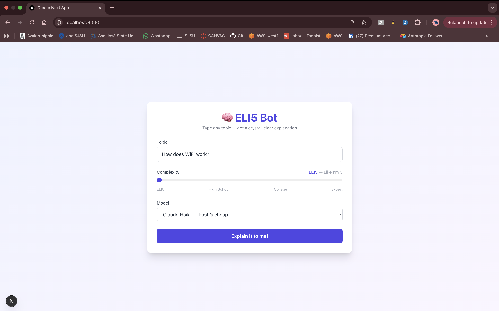
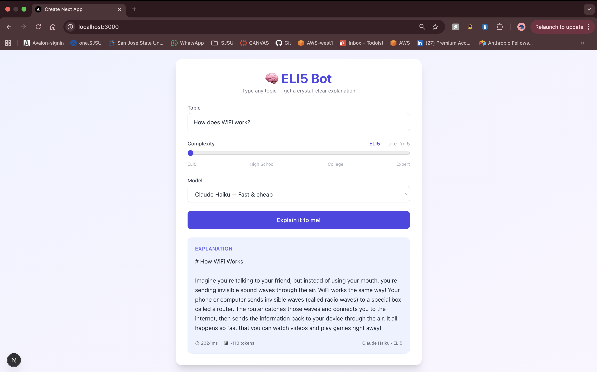
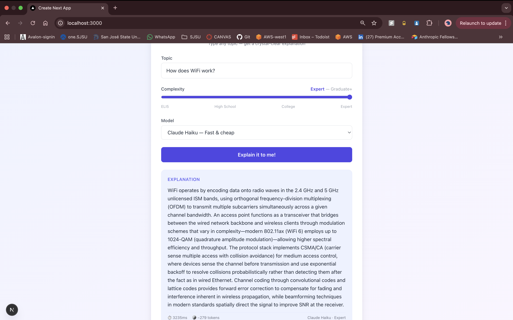

# 🧠 ELI5 Bot

> Paste any complex topic. Get an instant, crystal-clear explanation — streamed word by word, tuned to your level.

---

## 📸 Demo

### Screenshot the clean UI before any input


### ELI5 vs Expert — Same Topic, Different Complexity
| ELI5 | Expert |
|------|--------|
|  |  |

> *Topic: "How does the internet work?" — notice how the explanation adapts completely*

---

## ✨ Features

| Feature | Details |
|--------|---------|
| 🎚️ Complexity Slider | ELI5 → High School → College → Expert |
| 🤖 Model Selector | Claude Haiku (fast & cheap) or Claude Sonnet (smarter) |
| ⚡ Real-time Streaming | Words appear one by one as Claude generates them |
| 📊 Metrics Bar | Response time (ms) + estimated token count per request |
| ⌨️ Keyboard Support | Press Enter to submit |

---

## 🛠️ Tech Stack

| Layer | Technology |
|-------|-----------|
| Framework | [Next.js 16](https://nextjs.org/) — App Router |
| AI SDK | [Vercel AI SDK v6](https://sdk.vercel.ai/) — `streamText` |
| AI Provider | [@ai-sdk/anthropic](https://sdk.vercel.ai/providers/ai-sdk-providers/anthropic) |
| Models | `claude-haiku-4-5` · `claude-sonnet-4-6` |
| Styling | [Tailwind CSS v3](https://tailwindcss.com/) |
| Language | TypeScript |

---

## 🚀 Getting Started

### Prerequisites
- Node.js 18+
- An Anthropic API key from [console.anthropic.com](https://console.anthropic.com)

### 1. Clone the repo
```bash
git clone https://github.com/YOUR_USERNAME/eli5-bot.git
cd eli5-bot
```

### 2. Install dependencies
```bash
npm install
```

### 3. Configure environment
Create a `.env.local` file in the project root:
```bash
ANTHROPIC_API_KEY=sk-ant-xxxxxxxxxxxxxxxx
```
> ⚠️ Never commit this file. It is already protected by `.gitignore`.

### 4. Run locally
```bash
npm run dev
```
Open [http://localhost:3000](http://localhost:3000)

---

## 📁 Project Structure

```
eli5-bot/
├── app/
│   ├── api/
│   │   └── chat/
│   │       └── route.ts   # Streaming API route (Anthropic + streamText)
│   ├── globals.css        # Tailwind base styles
│   ├── layout.tsx         # Root layout
│   └── page.tsx           # Main UI (input, slider, dropdown, stream)
├── .env.local             # Your API key (never committed)
└── README.md
```
